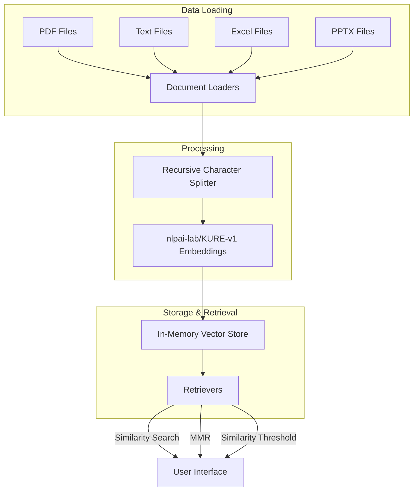
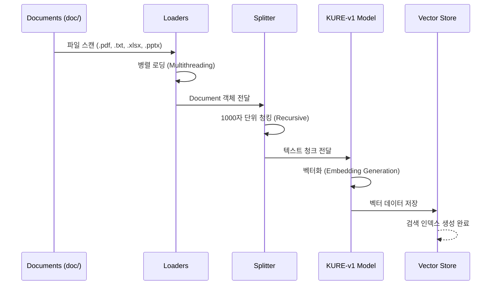

# KDDX 시맨틱 검색 엔진 (Embeddings) 기술 문서

이 문서는 `KDDX_Embeddings.py`의 핵심 기술 스택, 시스템 아키텍처 및 데이터 처리 흐름을 상세히 설명합니다.

---

## 🏗️ 시스템 아키텍처

`KDDX_Embeddings.py`는 LangChain 프레임워크를 기반으로 비정형 데이터를 벡터화하여 저장하고, 다양한 유사도 기반 검색을 수행하는 시스템입니다.



---

## 🛠️ 주요 컴포넌트 사양

| 컴포넌트 | 기술 스택 | 설명 |
| :--- | :--- | :--- |
| **Document Loaders** | `PyPDFLoader`, `TextLoader`, `UnstructuredExcelLoader`, `UnstructuredPowerPointLoader` | 다양한 문서 포맷 지원 및 다중 스레드 로딩 |
| **Text Splitter** | `RecursiveCharacterTextSplitter` | Chunk Size: 1000, Overlap: 200, 재귀적 분할 방식 |
| **Embedding Model** | `nlpai-lab/KURE-v1` (Sentence Transformers) | 한국어 문맥 이해에 최적화된 고성능 임베딩 모델 |
| **Vector Store** | `InMemoryVectorStore` | 실시간 빠른 검색이 가능한 인메모리 방식 벡터 저장소 |
| **Framework** | `LangChain`, `Streamlit` | 시맨틱 검색 파이프라인 및 UI 구축 |

---

## 🔄 데이터 처리 워크플로우

데이터 로딩부터 검색 준비까지의 과정을 나타낸 시퀀스 다이어그램입니다.



---

## 🔍 다중 검색 전략 (Retrieval Strategies)

`KDDX_Embeddings.py`는 상황별 최적의 검색 결과를 제공하기 위해 세 가지 주요 전략을 제공합니다.

| 전략 | 검색 방식 | 특징 및 장점 |
| :--- | :--- | :--- |
| **Similarity** | 기본 유사도 검색 | 입력한 쿼리와 가장 유사한 상위 $k$개 문서를 선정 |
| **MMR** | Maximum Marginal Relevance | 유사도와 결과의 다양성을 동시에 고려하여 중복 정보 방지 |
| **Threshold** | Similarity Score Threshold | 설정한 임계값(예: 0.6) 이상의 유사도를 가진 문서만 반환 |

---

## 💻 핵심 코드 구현 상세

### 1. 임베딩 모델 로컬 저장 및 로드

네트워크 환경에 구애받지 않도록 모델을 로컬에 저장하여 로드하는 로직을 사용합니다.

```python
# 모델 로컬 저장 로직 (최초 1회)
if not os.path.exists(save_path):
    model = SentenceTransformer(model_id)
    model.save(save_path)

# HuggingFaceEmbeddings를 통한 통합
embeddings = HuggingFaceEmbeddings(model_name=save_path)
```

### 2. 다이나믹 텍스트 분할

문맥 유지를 위해 200자의 중첩 영역을 설정하여 분할합니다.

```python
text_spliter = RecursiveCharacterTextSplitter(
    chunk_size = 1000,
    chunk_overlap = 200,
    add_start_index = True
)
```

---

## 🚀 사용 가이드

1. **데이터 준비**: `./doc` 폴더에 검색하고자 하는 문서를 배정합니다.
2. **환경 설정**: 필요한 라이브러리(`langchain`, `sentence-transformers`, `streamlit` 등)가 설치되어 있는지 확인합니다.
3. **실행**: 터미널에서 아래 명령어를 입력합니다.

    ```powershell
    streamlit run KDDX_Embeddings.py
    ```

4. **검색**: 웹 브라우저가 열리면 질문을 입력하여 시맨틱 검색 결과를 확인합니다.

> [!TIP]
> **성능 최적화**: 더 많은 문서 데이터가 있을 경우 `Chroma`나 `FAISS`와 같은 영구 저장형 벡터 데이터베이스로 전환하는 것을 권장합니다.
