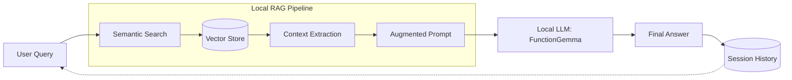
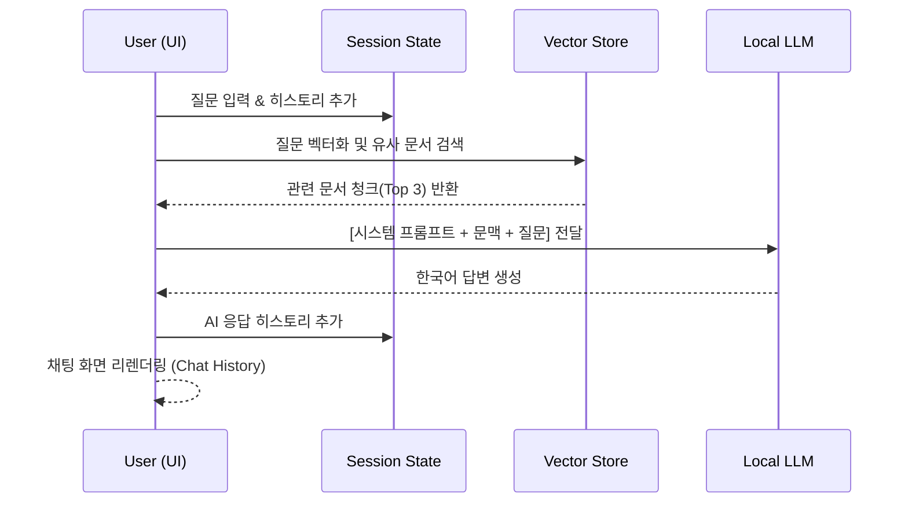

# KDDX RAG 검색엔진 챗봇 (Search & Chat) 기술 문서

이 문서는 시맨틱 검색과 로컬 LLM이 통합된 대화형 RAG(Retrieval-Augmented Generation) 시스템인 `KDDX_Search.py`의 구현 상세를 다룹니다.

---

## 🌟 시스템 개요

`KDDX_Search.py`는 사용자의 질문을 이해하고, 로컬 문서 저장소에서 가장 관련 있는 정보를 찾아, 보안이 유지되는 로컬 LLM을 통해 정확한 한국어 답변을 생성하는 지능형 어시스턴트입니다.



---

## 🎨 주요 기능 및 UI 구성

| 기능 | 설명 | 시각화 / 스타일 |
| :--- | :--- | :--- |
| **대화형 채팅** | `streamlit-chat`을 활용한 말풍선 기반 인터페이스 | User: 👤, AI: 🤖 |
| **시맨틱 검색** | `KURE-v1` 임베딩을 통한 고수준 문맥 일치 검색 | Semantic Similarity |
| **로컬 LLM 응답** | `functiongemma-270m-it` 기반의 한국어 특화 답변 생성 | Local GPU/CPU Inference |
| **대화 이력 관리** | `st.session_state`를 통한 멀티턴 대화 유지 | Persistent History |
| **대화 요약** | 사이드바 버튼을 통한 전체 대화 컨텍스트 요약 | Summary Button |

---

## 🔄 RAG 대화 처리 플로우

사용자가 질문을 입력하고 답변을 받기까지의 내부 프로세스입니다.



---

## 🛠️ 기술 사양 상세

### 1. 로컬 LLM 엔진

보안과 독립성을 위해 로컬 환경에서 구동되는 경량 모델을 사용합니다.

- **Model ID**: `google/functiongemma-270m-it`
- **Inference Engine**: `HuggingFacePipeline` (LangChain)
- **Quantization**: `torch_dtype="auto"` (환경에 맞춰 자동 최적화)

### 2. 세션 상태 (Session State) 구조

연속적인 대화를 위해 `LangChain`의 메시지 스키마를 따릅니다.

- `SystemMessage`: 챗봇의 페르소나 및 지침 정의
- `HumanMessage`: 사용자의 입력 기록
- `AIMessage`: 챗봇의 응답 기록 (참고 문헌 정보 포함)

### 3. 프롬프트 엔지니어링 (Advanced Prompt)

모델이 외부 지식(문맥)에 엄격히 기반하여 답변하도록 설계된 프롬프트입니다.

```text
<|system|>
당신은 전문적인 기술 지원 어시스턴트입니다. 제공된 [문맥]을 바탕으로 사용자의 [질문]에 정확하고 친절하게 한국어로 답변해 주세요.
반드시 제공된 문맥의 정보만을 사용하십시오.

[문맥]
{context_text}

<|user|>
[질문]
{query}

<|assistant|>
[답변]
```

---

## 📁 주요 코드 구조 분석

### 사이드바 및 대화 관리

```python
if summaries_button and llm:
    with st.spinner("대화 요약 중..."):
        # 전체 히스토리를 텍스트로 병합 후 LLM 요약 수행
        summary_response = llm.invoke(prompt_content)
        st.write(summary_response)
```

### 소스 투명성 (Source Transparency)

답변 하단에 어떤 문서를 참고했는지와 유사도 점수를 표시하여 신뢰성을 확보합니다.

```python
source_info = "\n\n---\n**참고 문서:**\n"
for i, (doc, score) in enumerate(results):
    source = doc.metadata.get('source', '알 수 없음')
    source_info += f"- {os.path.basename(source)} (유사도: {score:.4f})\n"
```

---

## 💡 성능 향상 팁

> [!IMPORTANT]
> **캐싱 활용**: `st.cache_resource`를 통해 모델 로딩 시간을 단축하였습니다. 최초 로드 이후에는 메모리에서 즉시 호출됩니다.

> [!TIP]
> **GPU 가속**: `device_map="auto"`를 통해 NVIDIA GPU가 있을 경우 자동으로 CUDA 가속이 적용됩니다.

---

## 📖 사용 방법

1. **초기화**: `./doc` 폴더에 문서를 넣고 앱을 실행합니다.
2. **질문 전송**: 메인 영역의 텍스트 박스에 질문을 입력하고 '전송'을 누릅니다.
3. **요약/초기화**: 사이드바의 버튼을 통해 대화를 관리합니다.
